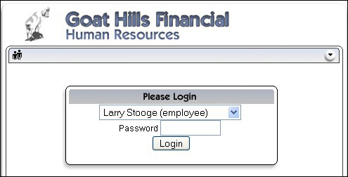
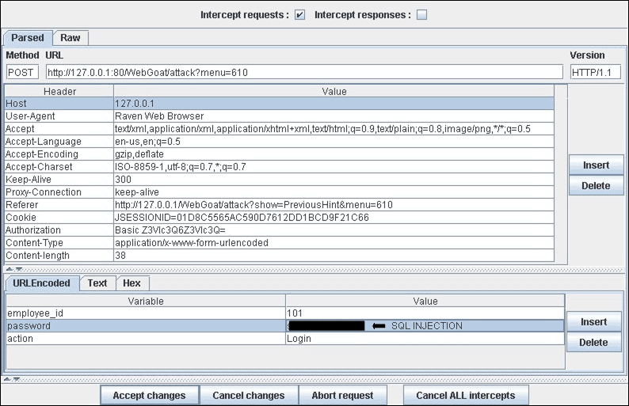

# Тестування на обхід схеми автентифікації

|ID          |
|------------|
|WSTG-ATHN-04|

## Короткий огляд

У комп'ютерній безпеці автентифікація — це процес спроби перевірки цифрової ідентичності відправника. Прикладом такого процесу є вхід у систему. Тестування схеми автентифікації полягає в розумінні того, як працює автентифікація, і використанні цієї інформації для обходу механізму автентифікації.

Хоча більшість додатків вимагають автентифікацію для доступу до приватної інформації або виконання завдань, не всі методи автентифікації можуть забезпечити належний рівень безпеки. Недбалість, незнання або недооцінка загроз безпеці часто призводять до схем автентифікації, які можна обійти, просто пропустивши сторінку входу і безпосередньо звернувшись до внутрішньої сторінки, яка повинна бути доступна тільки після проходження автентифікації.

Також часто можна обійти автентифікацію, підробивши запити і обдуривши додаток, змусивши його думати, що користувач уже автентифікований. Це можна зробити, змінивши параметр URL, маніпулюючи формою або підробивши сесію.

Проблеми, пов'язані зі схемою автентифікації, можуть виникати на різних етапах життєвого циклу розробки програмного забезпечення (SDLC): на етапі проєктування, розробки та впровадження:

- Помилки на етапі проєктування можуть включати неправильне визначення захищених розділів додатка, відсутність сильних протоколів шифрування для передачі облікових даних тощо.
- На етапі розробки можуть виникнути помилки, пов'язані з некоректною валідацією введених даних або недотриманням найкращих практик безпеки для конкретної мови програмування.
- На етапі впровадження додатка можуть виникати проблеми через недостатній рівень технічних навичок або через відсутність документації.

## Мета тестування

- Переконатися, що автентифікація застосовується для всіх сервісів, які цього потребують.

## Як тестувати

### Тестування методом "чорного ящика"

Існує кілька методів обходу схеми автентифікації, яка використовується веб-додатком:

- Прямий запит сторінки ([forced browsing](https://owasp.org/www-community/attacks/Forced_browsing))
- Модифікація параметрів
- Прогнозування ідентифікаторів сесій
- SQL-ін'єкція

#### Прямий запит сторінки

Якщо веб-додаток реалізує контроль доступу тільки на сторінці входу, схему автентифікації можна обійти. Наприклад, якщо користувач безпосередньо запитує іншу сторінку через примусове переглядання, ця сторінка може не перевіряти облікові дані користувача перед наданням доступу. Спробуйте безпосередньо отримати доступ до захищеної сторінки через адресний рядок браузера для тестування цим методом.

\
*Рисунок 4.4.4-1: Прямий запит до захищеної сторінки*

#### Модифікація параметрів

Іншою проблемою, пов'язаною з проєктуванням автентифікації, є перевірка успішного входу на основі фіксованих значень параметрів. Користувач може змінити ці параметри, щоб отримати доступ до захищених зон без надання дійсних облікових даних. У наведеному нижче прикладі параметр "authenticated" змінено на значення "yes", що дозволяє користувачеві отримати доступ. У цьому прикладі параметр знаходиться в URL, але також можна використовувати проксі-сервер для зміни параметра, особливо коли параметри передаються у вигляді елементів форми у POST-запиті або коли параметри зберігаються в кукі.

```html
http://www.site.com/page.asp?authenticated=no

raven@blackbox /home $nc www.site.com 80
GET /page.asp?authenticated=yes HTTP/1.0

HTTP/1.1 200 OK
Date: Sat, 11 Nov 2006 10:22:44 GMT
Server: Apache
Connection: close
Content-Type: text/html; charset=iso-8859-1

<!DOCTYPE HTML PUBLIC "-//IETF//DTD HTML 2.0//EN">
<HTML><HEAD>
</HEAD><BODY>
<H1>Ви автентифіковані</H1>
</BODY></HTML>
```

\
*Рисунок 4.4.4-2: Змінений запит параметра*

#### Прогнозування ідентифікаторів сесій

Багато веб-додатків керують автентифікацією за допомогою ідентифікаторів сесій (session ID). Тому, якщо генерація сесійних ідентифікаторів передбачувана, зловмисник може знайти дійсний ідентифікатор сесії і отримати несанкціонований доступ до додатка, видаючи себе за вже автентифікованого користувача.

На наступному малюнку значення всередині кукі збільшуються лінійно, тому зловмисник може легко вгадати дійсний сесійний ідентифікатор.

\
*Рисунок 4.4.4-3: Значення кукі з часом*

На наступному малюнку значення всередині кукі змінюються лише частково, тому зловмисник може обмежити атаку методом грубої сили до показаних полів.

\
*Рисунок 4.4.4-4: Частково змінені значення кукі*

#### SQL-ін'єкція (HTML-форма автентифікації)

SQL-ін'єкція — це відомий метод атаки. Цей розділ не буде детально описувати цю техніку, оскільки в керівництві є кілька розділів, які пояснюють техніки ін'єкції більш детально.

\
*Рисунок 4.4.4-5: SQL-ін'єкція*

На наступному малюнку показано, що за допомогою простої SQL-ін'єкції можна обійти форму автентифікації.

\
*Рисунок 4.4.4-6: Проста атака SQL-ін'єкції*

### Тестування методом "сірого ящика"

Якщо зловмисник зміг отримати вихідний код додатка, експлуатуючи раніше виявлену вразливість (наприклад, Directory Traversal), або з веб-репозиторію (Open Source Applications), він може виконати витончені атаки проти процесу автентифікації.

У наступному прикладі (PHPBB 2.0.13 - вразливість обходу автентифікації) на 5-му рядку функція `unserialize()` обробляє кукі, введені користувачем, і встановлює значення всередині масиву `$row`. На 10-му рядку хеш пароля користувача порівнюється з тим, що зберігається в базі даних.

```php
if (isset($HTTP_COOKIE_VARS[$cookiename . '_sid']) {
    $sessiondata = isset($HTTP_COOKIE_VARS[$cookiename . '_data']) ? unserialize(stripslashes($HTTP_COOKIE_VARS[$cookiename . '_data'])) : array();
    $sessionmethod = SESSION_METHOD_COOKIE;
}
if(md5($password) == $row['user_password'] && $row['user_active']) {
    $autologin = (isset($HTTP_POST_VARS['autologin'])) ? TRUE : 0;
}
```
У PHP порівняння між строковим значенням і булевим значенням (1 і `TRUE`) завжди `TRUE`, тому, надавши наступний рядок (важлива частина — `b:1`) функції `unserialize()`, можна обійти контроль автентифікації:

```text
a:2:{s:11:"autologinid";b:1;s:6:"userid";s:1:"2";}
```
## Інструменти

- [WebGoat](https://owasp.org/www-project-webgoat/)
- [OWASP Zed Attack Proxy (ZAP)](https://www.zaproxy.org)

## Посилання

### Статті

- Mark Roxberry: "PHPBB 2.0.13 вразливість"
- [David Endler: "Session ID Brute Force Exploitation and Prediction"](https://www.cgisecurity.com/lib/SessionIDs.pdf)