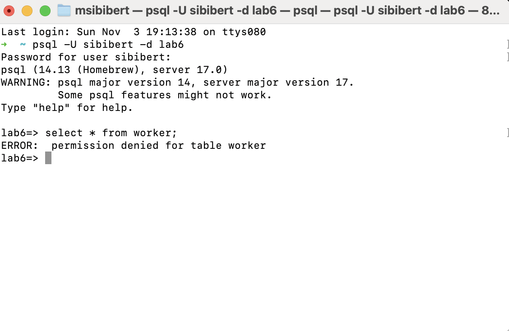
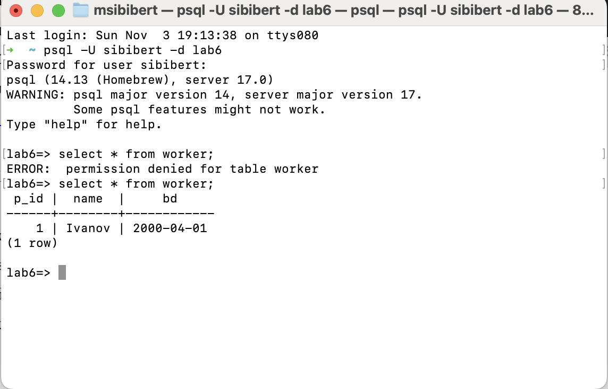
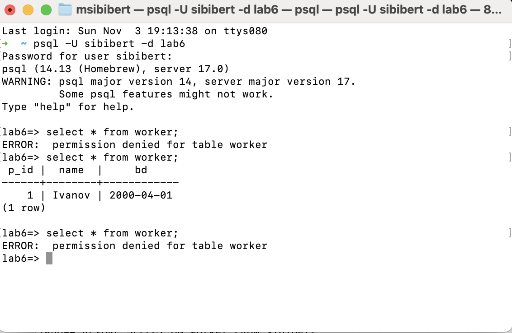
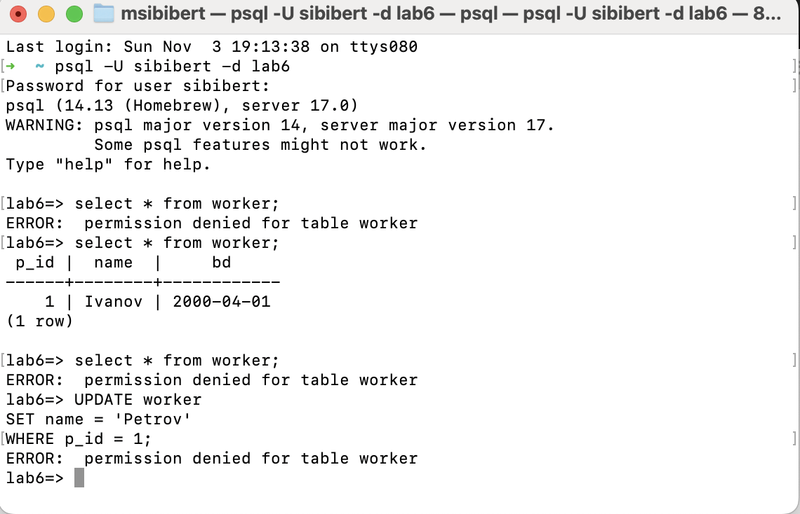
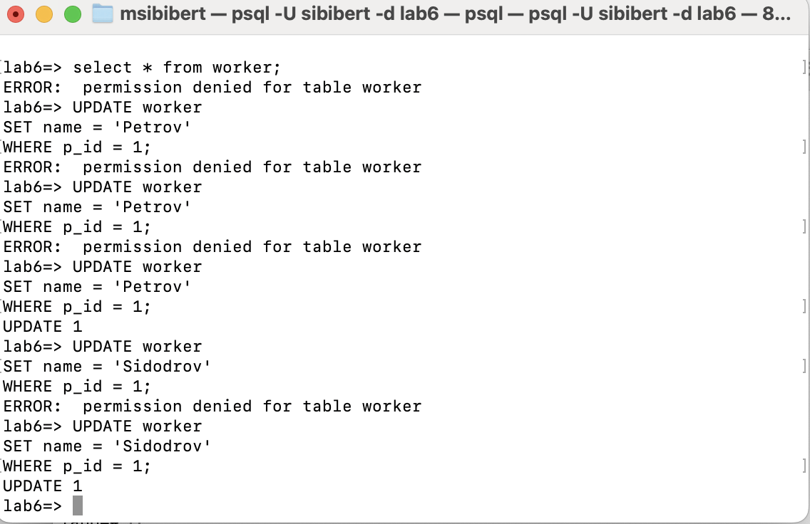
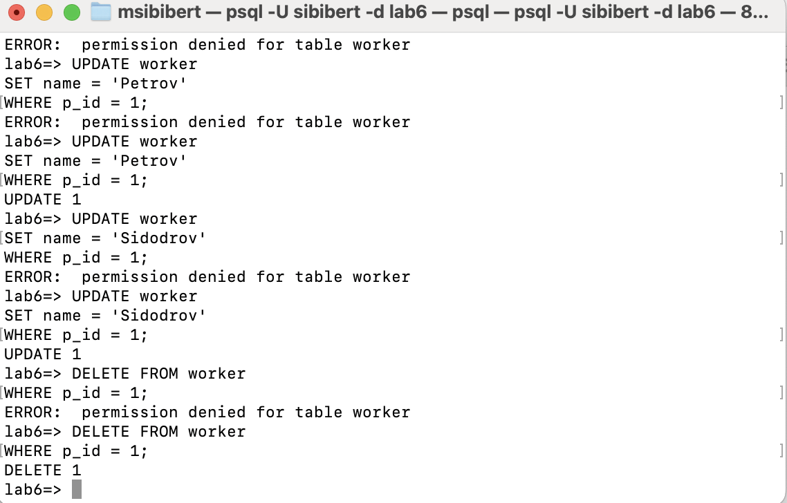
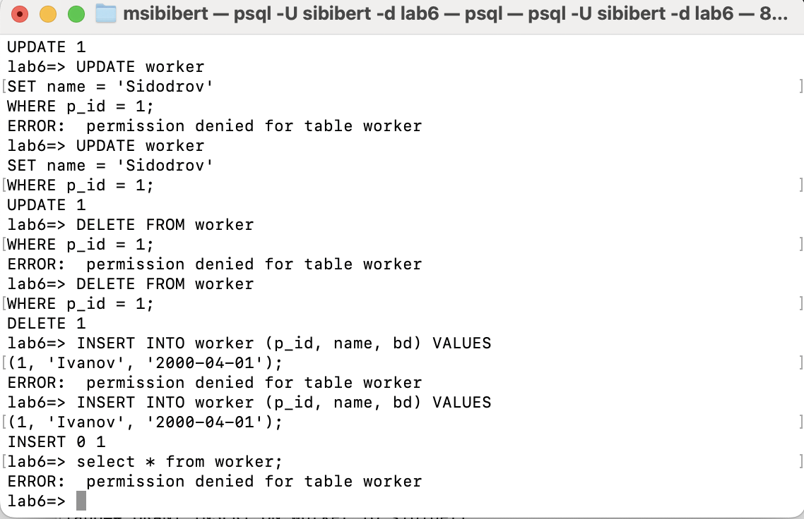
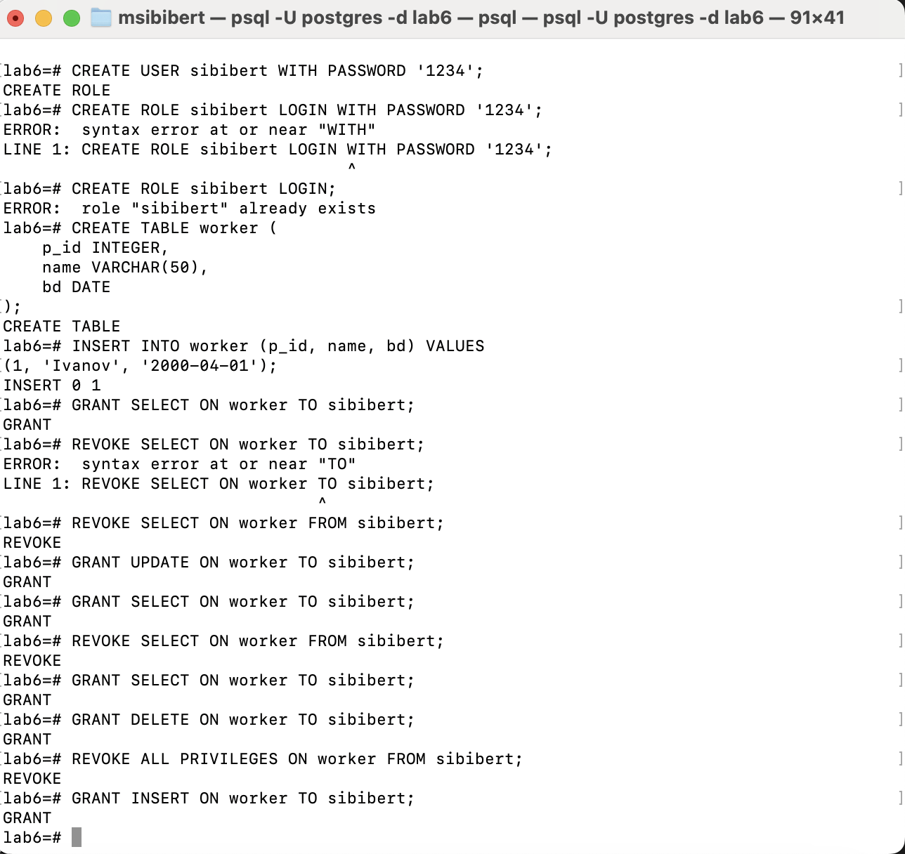

*Від імені нового користувача виконайте запит на отримання даних з таблиці (select * from таблиця).*

\

*Надав доступ*

\

*Забрав доступ*

\

*Від імені нового користувача виконайте запит update.*

\

*Надав доступ update and select тому що без select не працює update*

\

*Від імені нового користувача виконайте запит delete.*

\

*Від імені нового користувача виконайте запит insert.*

\

*Команди від імені адміна*

\