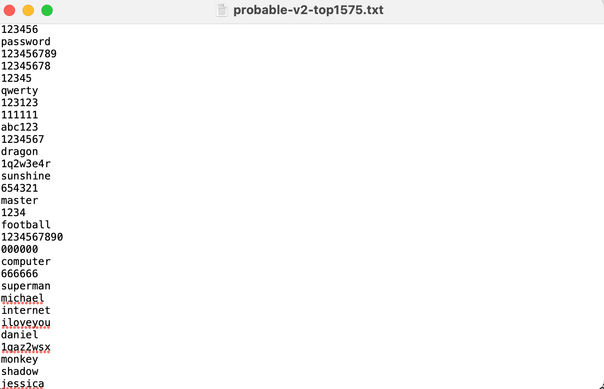
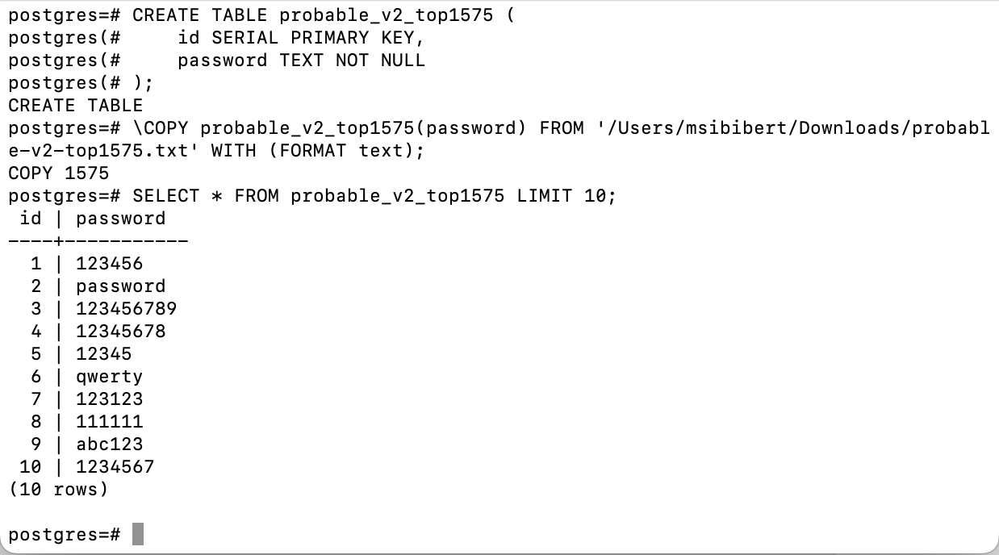

## 2.2 Перевірка надійності пароля за списком "10000 найгірших паролів"

### 2.2.1 В репозиторії https://github.com/danielmiessler/SecLists/tree/master/Passwords розміщено файли зі списку "10000 найгірших паролів", назви яких представлено в таблиці 1. Отримати файл, номер якого відповідає вашому варіанту.

### 2.2.2 Створити таблицю в БД СКБД PostgreSQL, назва якої відповідає назві файлу, та завантажити вміст файлу у таблицю, використовуючи будь-який засіб імпорту, наприклад, команду \COPY утиліти psql.

